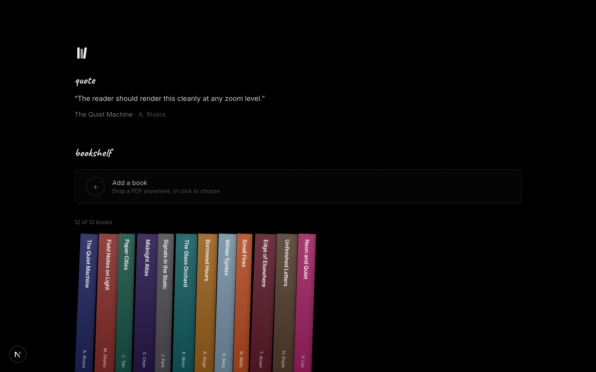
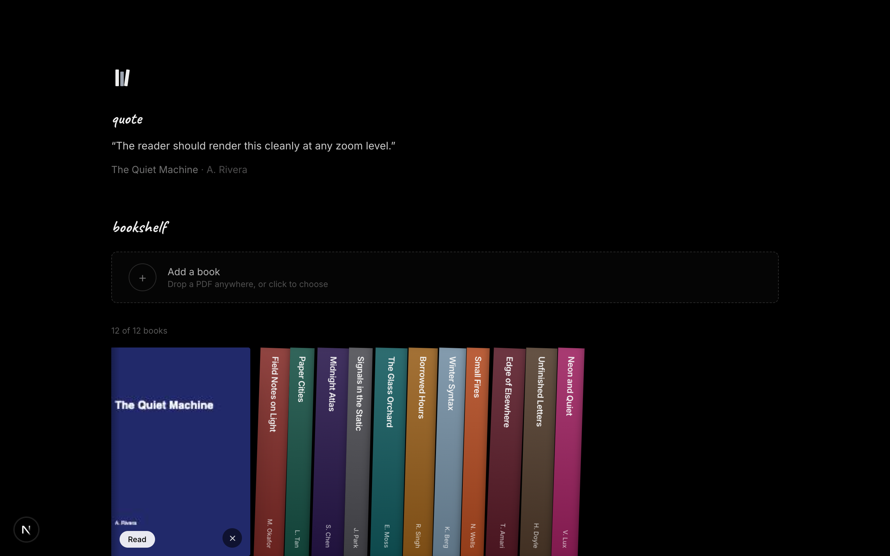
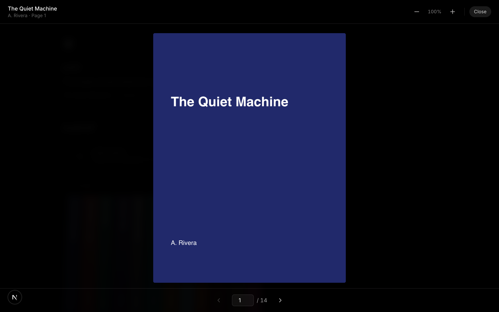

# Bookshelf

A minimal, 3D bookshelf for your own PDFs — inspired by the bookshelf on
[grizz.fyi](https://grizz.fyi). Add any book as a PDF and it lands on the shelf
spine-out. Hover to pull a book out, click to read it. Everything is stored
locally in your browser; your files never leave the device.



## Preview

| Shelf | Pull a book out | Read |
| --- | --- | --- |
|  |  |  |
| Drop PDFs onto the shelf — covers and spines are generated automatically | Hover to swing the cover forward and reveal the title | Click **Read** for page navigation, zoom, and keyboard shortcuts |

## How it works

- **3D shelf** — each book is a CSS 3D object. The cover/spine plane rotates
  around its left edge (the binding): closed books sit at `rotateY(90deg)`
  showing only the spine, the active book swings to `rotateY(0deg)` and its
  footprint expands to the full cover width. This mirrors the grizz.fyi shelf.
- **Covers & spines** — when you add a PDF, the first page is rendered to a
  canvas (via `pdf.js`) and used as the cover. A dominant colour is sampled from
  that page to generate a matching spine with the title set vertically.
- **Reading** — clicking the pulled-out book opens a full-screen reader that
  renders pages on demand with zoom, page navigation, and keyboard shortcuts.
- **Storage** — book metadata and the PDF blobs are saved in **IndexedDB**, so
  your shelf persists across reloads without any server.

## Stack

- Next.js 16 (App Router) · React 19 · TypeScript
- Tailwind CSS v4
- Zustand (state) · `idb` (IndexedDB) · `pdfjs-dist` (rendering)

## Getting started

```bash
npm install
npm run dev
```

Open the app, then drag a PDF anywhere onto the page (or click **Add a book**).

### Try it with samples

A few sample PDFs are generated into `public/samples`. Regenerate them with:

```bash
node scripts/make-samples.mjs
```

Then drag any file from `public/samples` onto the shelf.

### Refresh screenshots

To regenerate the README preview images (requires a running dev server):

```bash
npm run dev
npm run screenshots
```

## Keyboard shortcuts (reader)

| Key            | Action          |
| -------------- | --------------- |
| `←` / `→`      | Previous / next |
| `+` / `-`      | Zoom in / out   |
| `Esc`          | Close the book  |

## Project structure

```
src/
├── app/                  # routes, layout, theme
├── components/
│   ├── bookshelf/        # 3D shelf, books, add tile, drop overlay
│   └── reader/           # full-screen PDF reader
├── lib/                  # IndexedDB, pdf.js processing, colour sampling
├── store/                # Zustand store
└── types/                # shared types
```
